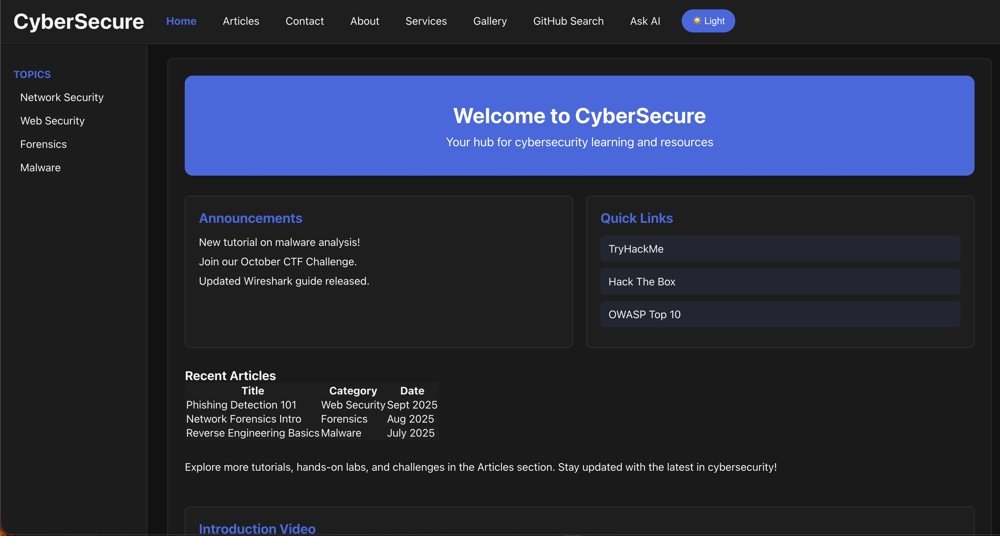
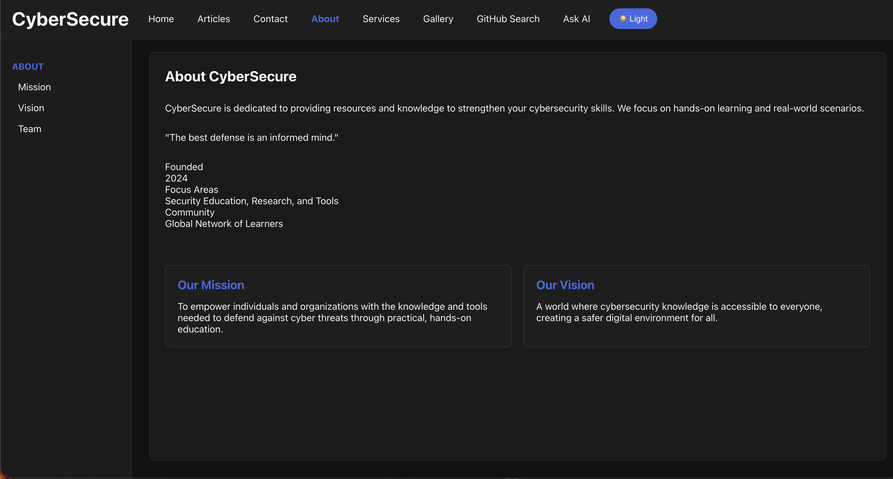
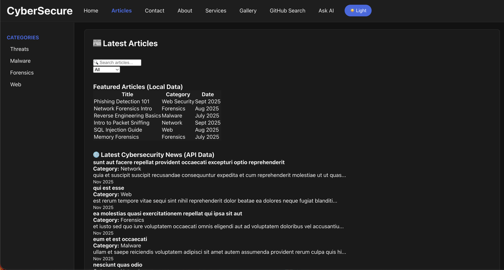
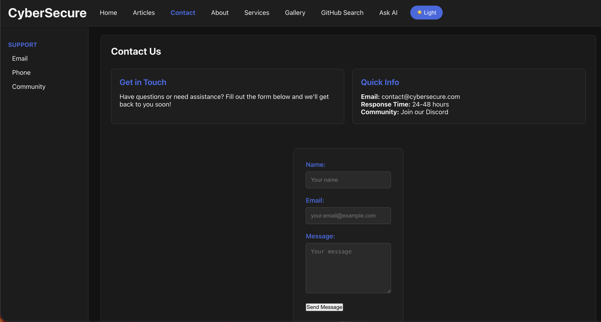
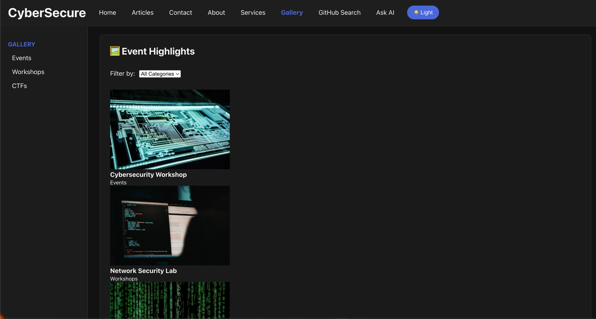
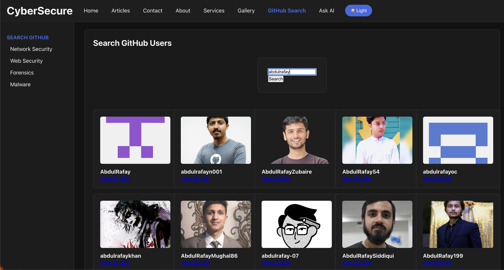
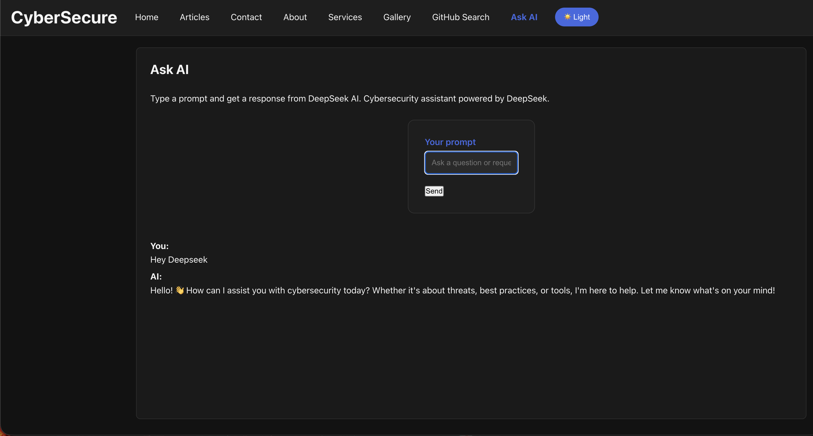
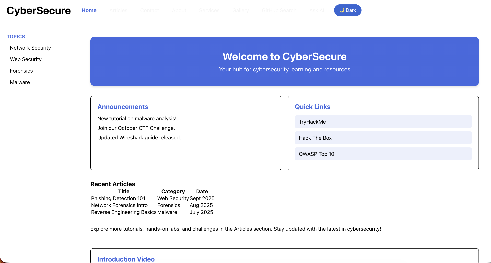

# CyberSecure - Cybersecurity Learning Platform

A modern, responsive web application built with React for cybersecurity education and resources. This platform provides interactive learning materials, real-time AI assistance, and comprehensive cybersecurity content.

## Table of Contents

- [Features](#features)
- [Screenshots](#screenshots)
- [Prerequisites](#prerequisites)
- [Installation](#installation)
- [Project Structure](#project-structure)
- [Available Scripts](#available-scripts)
- [API Integration](#api-integration)
- [Environment Variables](#environment-variables)
- [Deployment](#deployment)
- [Troubleshooting](#troubleshooting)
- [Contributing](#contributing)
- [License](#license)

## Features

### Core Functionality
- **Multi-Page Navigation**: React Router implementation with 8 distinct pages
- **Interactive Articles**: Cybersecurity articles from local JSON and external APIs
- **GitHub User Search**: Integration with GitHub API for user discovery
- **AI Chat Assistant**: Real-time cybersecurity assistance powered by DeepSeek AI
- **Contact Form**: Firebase Firestore integration with localStorage fallback
- **Theme Persistence**: Dark/Light mode with localStorage persistence
- **Responsive Gallery**: Filterable image gallery with categories
- **Video Content**: Embedded educational videos

### Technical Highlights
- React 18 with Hooks (useState, useEffect)
- Firebase Firestore for data storage
- RESTful API integration (JSONPlaceholder, GitHub, DeepSeek)
- Local JSON data management
- Browser storage persistence
- Responsive CSS design
- Clean component architecture

## Screenshots

### Task 1: Main Website Pages

#### Home Page

*The landing page featuring announcements, quick links, recent articles, and an embedded introduction video.*

#### About Page

*Information about our mission, vision, and cybersecurity education approach.*

#### Articles Page

*Browse cybersecurity articles from both local JSON data and the JSONPlaceholder API with search and filter functionality.*

#### Contact Page

*Contact form with Firebase Firestore integration and localStorage fallback.*

#### Services Page

*Overview of cybersecurity training courses and services offered.*

#### Gallery Page

*Filterable image gallery showcasing cybersecurity topics and events.*

### Task 2: GitHub Search & AI Chat

#### GitHub Search Page

*Search GitHub users in real-time using the GitHub API with user avatars and profile links.*

#### AI Chat Page

*Interactive AI assistant powered by DeepSeek for cybersecurity questions and guidance.*

#### Theme Toggle (Light Mode)

*Application in light mode demonstrating theme switching capability.*

## Prerequisites

- Node.js (v14 or higher)
- npm or yarn
- Firebase account (optional, for contact form)
- DeepSeek API key (optional, for AI chat)

## Installation

1. **Clone the repository**
   ```bash
   git clone <repository-url>
   cd cybersecure-react
   ```

2. **Install dependencies**
   ```bash
   npm install
   ```

3. **Configure environment variables**
   
   Copy `.env.example` to `.env` and add your API keys:
   ```bash
   cp .env.example .env
   ```

   Edit `.env` with your credentials:
   ```env
   # Firebase Configuration (Optional)
   REACT_APP_FIREBASE_API_KEY=your_firebase_api_key
   REACT_APP_FIREBASE_AUTH_DOMAIN=your_project.firebaseapp.com
   REACT_APP_FIREBASE_PROJECT_ID=your_project_id
   REACT_APP_FIREBASE_STORAGE_BUCKET=your_project.appspot.com
   REACT_APP_FIREBASE_MESSAGING_SENDER_ID=your_sender_id
   REACT_APP_FIREBASE_APP_ID=your_app_id

   # DeepSeek AI API Key (Optional)
   REACT_APP_DEEPSEEK_API_KEY=your_deepseek_api_key
   ```

4. **Start the development server**
   ```bash
   npm start
   ```

   The application will open at `http://localhost:3000`

## Project Structure

```
cybersecure-react/
├── public/
│   ├── index.html
│   └── robots.txt
├── src/
│   ├── assets/
│   │   ├── images/          # Optional: Store local images
│   │   └── videos/          # Optional: Store local video files
│   ├── components/          # Reusable React components
│   │   ├── AIChat.js
│   │   ├── ArticleCard.js
│   │   ├── Badge.js
│   │   ├── Card.js
│   │   ├── Footer.js
│   │   ├── Header.js
│   │   ├── Sidebar.js
│   │   └── VideoPlayer.js
│   ├── data/
│   │   └── content.json     # Local content data
│   ├── pages/               # Page components
│   │   ├── About.js
│   │   ├── Articles.js
│   │   ├── Contact.js
│   │   ├── Gallery.js
│   │   ├── GitHubSearch.js
│   │   ├── Home.js
│   │   └── Services.js
│   ├── services/
│   │   └── firebase.js      # Firebase configuration
│   ├── styles/
│   │   └── global.css       # Global styles
│   ├── App.js               # Main application component
│   ├── App.css
│   ├── index.js             # Application entry point
│   └── index.css
├── .env.example             # Environment variables template
├── .gitignore
├── package.json
└── README.md
```

## Available Scripts

### `npm start`
Runs the app in development mode at [http://localhost:3000](http://localhost:3000)

### `npm build`
Builds the app for production to the `build` folder

### `npm test`
Launches the test runner in interactive watch mode

### `npm eject`
**Note: this is a one-way operation**. Ejects from Create React App for full configuration control.

## API Integration

### External APIs
- **JSONPlaceholder**: Demo articles and posts (`https://jsonplaceholder.typicode.com/posts`)
- **GitHub API**: User search functionality (`https://api.github.com/search/users`)
- **DeepSeek AI**: Intelligent chat responses via OpenRouter

### Local Data
All non-API content is stored in `src/data/content.json`:
- Site information
- Announcements
- Quick links
- Local articles
- Services
- Gallery images
- Categories

## Features in Detail

### Theme Management
- Persistent dark/light mode
- Stored in browser localStorage
- Applies on page load

### Firebase Integration
- Contact form submissions stored in Firestore
- Automatic fallback to localStorage if Firebase is unavailable
- Environment-based configuration

### AI Chat Assistant
- Powered by DeepSeek via OpenRouter
- Cybersecurity-focused responses
- Conversation history display
- Error handling with user-friendly messages

### GitHub Search
- Real-time user search
- Display user avatars and profiles
- Rate limit handling
- Direct links to GitHub profiles

## Assets Folders

### `src/assets/images/`
**Optional**: Store local image files here if needed. The gallery currently uses placeholder URLs, but you can add your own images.

### `src/assets/videos/`
**Optional**: Store local video files here if needed. Currently using YouTube embeds, but local videos can be added.

**Note**: These folders are placeholders and **not required** for the application to function. All images in the gallery use external URLs, and videos are embedded from YouTube. You can leave these folders empty or add your own media assets if you want to use local files instead of external links.

## Environment Variables

| Variable | Required | Description |
|----------|----------|-------------|
| `REACT_APP_FIREBASE_API_KEY` | No | Firebase API key for contact form |
| `REACT_APP_FIREBASE_AUTH_DOMAIN` | No | Firebase auth domain |
| `REACT_APP_FIREBASE_PROJECT_ID` | No | Firebase project ID |
| `REACT_APP_FIREBASE_STORAGE_BUCKET` | No | Firebase storage bucket |
| `REACT_APP_FIREBASE_MESSAGING_SENDER_ID` | No | Firebase messaging sender ID |
| `REACT_APP_FIREBASE_APP_ID` | No | Firebase app ID |
| `REACT_APP_DEEPSEEK_API_KEY` | No | DeepSeek API key for AI chat |

## Deployment

### Build for Production
```bash
npm run build
```

### Deploy to Hosting Service
The build folder can be deployed to:
- Firebase Hosting
- Netlify
- Vercel
- GitHub Pages
- Any static hosting service

## Troubleshooting

### Node.js localStorage Error
If you encounter localStorage errors during build with Node v25+:
```bash
# The package.json already includes this fix
NODE_OPTIONS='--no-experimental-webstorage' npm start
```

### Firebase Not Working
- Check that all Firebase environment variables are set correctly
- Verify Firebase project permissions
- The app will automatically fall back to localStorage if Firebase fails

### AI Chat Not Responding
- Verify `REACT_APP_DEEPSEEK_API_KEY` is set in `.env`
- Check browser console for API errors
- Ensure you have restarted the dev server after adding the key

## Browser Support

- Chrome (latest)
- Firefox (latest)
- Safari (latest)
- Edge (latest)

## Contributing

1. Fork the repository
2. Create your feature branch (`git checkout -b feature/AmazingFeature`)
3. Commit your changes (`git commit -m 'Add some AmazingFeature'`)
4. Push to the branch (`git push origin feature/AmazingFeature`)
5. Open a Pull Request

## License

This project is created for educational purposes.

## Acknowledgments

- React team for the amazing framework
- Firebase for backend services
- DeepSeek for AI capabilities
- GitHub API for user data
- JSONPlaceholder for demo data

## Contact

For questions or support, use the contact form in the application or reach out via the repository issues.

---

**Built with React** | **Powered by DeepSeek AI** | **Secured by Firebase**


## API Integration

### External APIs
- **JSONPlaceholder**: Demo articles and posts
- **GitHub API**: User search functionality
- **DeepSeek AI**: Intelligent chat responses via OpenRouter

### Local Data
All non-API content is stored in `src/data/content.json`:
- Site information
- Announcements
- Quick links
- Local articles
- Services
- Gallery images
- Categories

## Features in Detail

### Theme Management
- Persistent dark/light mode
- Stored in browser localStorage
- Applies on page load

### Firebase Integration
- Contact form submissions stored in Firestore
- Automatic fallback to localStorage if Firebase is unavailable
- Environment-based configuration

### AI Chat Assistant
- Powered by DeepSeek via OpenRouter
- Cybersecurity-focused responses
- Conversation history display
- Error handling with user-friendly messages

### GitHub Search
- Real-time user search
- Display user avatars and profiles
- Rate limit handling
- Direct links to GitHub profiles

## Browser Support

- Chrome (latest)
- Firefox (latest)
- Safari (latest)
- Edge (latest)

## Assets Folders

### `src/assets/images/`
**Optional**: Store local image files here if needed. The gallery currently uses placeholder URLs, but you can add your own images:
```
images/
├── logo.png
├── banner.jpg
├── gallery/
│   ├── image1.jpg
│   └── image2.jpg
```

### `src/assets/videos/`
**Optional**: Store local video files here if needed. Currently using YouTube embeds, but local videos can be added:
```
videos/
├── intro.mp4
└── tutorial.mp4
```

**Note**: These folders are placeholders and **not required** for the application to function. All images in the gallery use external URLs, and videos are embedded from YouTube. You can leave these folders empty or add your own media assets if you want to use local files instead of external links.

## Deployment

### Build for Production
```bash
npm run build
```

### Deploy to Hosting Service
The build folder can be deployed to:
- Firebase Hosting
- Netlify
- Vercel
- GitHub Pages
- Any static hosting service

## Environment Variables

| Variable | Required | Description |
|----------|----------|-------------|
| `REACT_APP_FIREBASE_API_KEY` | No | Firebase API key for contact form |
| `REACT_APP_FIREBASE_AUTH_DOMAIN` | No | Firebase auth domain |
| `REACT_APP_FIREBASE_PROJECT_ID` | No | Firebase project ID |
| `REACT_APP_FIREBASE_STORAGE_BUCKET` | No | Firebase storage bucket |
| `REACT_APP_FIREBASE_MESSAGING_SENDER_ID` | No | Firebase messaging sender ID |
| `REACT_APP_FIREBASE_APP_ID` | No | Firebase app ID |
| `REACT_APP_DEEPSEEK_API_KEY` | No | DeepSeek API key for AI chat |

## Troubleshooting

### Node.js localStorage Error
If you encounter localStorage errors during build with Node v25+:
```bash
# The package.json already includes this fix
NODE_OPTIONS='--no-experimental-webstorage' npm start
```

### Firebase Not Working
- Check that all Firebase environment variables are set correctly
- Verify Firebase project permissions
- The app will automatically fall back to localStorage if Firebase fails

### AI Chat Not Responding
- Verify `REACT_APP_DEEPSEEK_API_KEY` is set in `.env`
- Check browser console for API errors
- Ensure you have restarted the dev server after adding the key

## Contributing

1. Fork the repository
2. Create your feature branch (`git checkout -b feature/AmazingFeature`)
3. Commit your changes (`git commit -m 'Add some AmazingFeature'`)
4. Push to the branch (`git push origin feature/AmazingFeature`)
5. Open a Pull Request

## License

This project is created for educational purposes.

## Acknowledgments

- React team for the amazing framework
- Firebase for backend services
- DeepSeek for AI capabilities
- GitHub API for user data
- JSONPlaceholder for demo data

## Contact

For questions or support, use the contact form in the application or reach out via the repository issues.

---

**Built with React** | **Powered by DeepSeek AI** | **Secured by Firebase**
